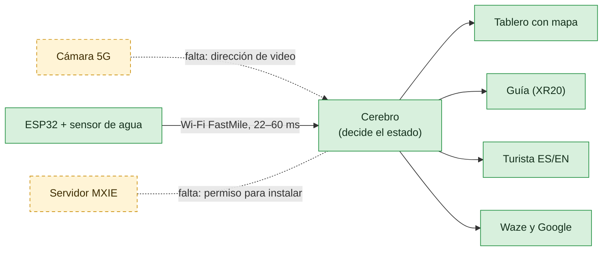

# Paso Seguro 5G · Qué tenemos y qué falta

Grupo 6 (CORA 5G) · miércoles 7 de octubre de 2026

## En tres frases

1. **Ya está construido el cerebro del sistema.** Es un programa que mira el nivel del río con la cámara, decide si el cruce está LIBRE, en CUIDADO o CERRADO, y avisa al guía, al turista y a los mapas.
2. **Lo probamos completo en una laptop con un río simulado** (video y sensor de prueba). Funciona y decide en milisegundos.
3. **Miércoles 7: el sensor real ya manda el nivel por Wi-Fi y el cerebro decide con él.** El ESP32 mide el agua con el ultrasónico, lo envía por la red FastMile y el semáforo cambia en vivo (probado con un cartón: 78 cm → 29 cm = 0 % → 100 %). Faltan la cámara 5G, el servidor MXIE y los teléfonos XR20.



Verde: listo y probado. Amarillo: hay que conectarlo con el equipo real.

## Qué se construyó (listo)

| Pieza | Qué hace | Estado |
|---|---|---|
| **Cerebro** (servidor de borde) | Lee la cámara, mide el agua en la regla y suma el flotador y la lluvia del IMN para decidir | ✅ Probado con 157 pruebas automáticas |
| **Tablero** | Estado en grande, video, mapa del cruce, latencia en vivo y lista de eventos | ✅ Probado en el navegador |
| **Página del guía** (XR20) | Alerta con sirena, voz, vibración y video, y botón para cerrar el cruce | ✅ Probada |
| **Página del turista** | Aviso en español e inglés, para un código QR | ✅ Probada |
| **ESP32 con sensor de agua** | Mide el nivel con el ultrasónico y lo manda al cerebro por Wi-Fi (FastMile). Avisa aunque no haya red. | ✅ **Funciona en la placa** (7-oct): nivel real en el cerebro, 22–60 ms · ⏳ flotador sin conectar · ⏳ convertidor de nivel sin soldar |
| **Programa del Arduino UNO** | Lo mismo que el ESP32, pero por cable de red al CPE | Respaldo: el cable de red al CPE no dio enlace. Queda guardado |
| **Mapas** | Aviso en el formato oficial de Waze (válido) y en el de Google Maps | ✅ Validado · publicarlo requiere a un socio oficial, como el MOPT |
| **Lluvia del IMN** | Datos reales de las 8 estaciones | ✅ Funciona cuando hay internet |
| **Ensayo sin equipo** | Video y sensor simulados, más botones de demo | ✅ Listo |

## Qué falta para conectarlo (martes 6)

| # | Conexión | Qué hay que hacer | Si no se puede |
|---|---|---|---|
| 1 | Cámara 5G → cerebro | Pedir a la PCII la dirección de video (RTSP), ponerla en la configuración y calibrar con 5 clics | Webcam USB, o un XR20 como cámara |
| 2 | Cerebro → servidor MXIE | Pedir permiso para instalar nuestro programa (contenedor) y cargarlo | Una laptop conectada a la red 5G hace de servidor |
| 3 | ESP32 → red | ✅ **Listo** (7-oct). Falta: calibrar con la maqueta (distancia con agua vacía y llena), conectar el flotador y soldar el convertidor de nivel (hoy el Echo de 5 V entra directo a la ESP32) | Avisa solo, en modo local |
| 4 | Teléfono del guía | Abrir la página del guía en el XR20 y tocar «Activar alertas». Preguntar si Team Comms se puede disparar desde un programa | La página del guía ya hace sirena, voz y video |
| 5 | Internet | ✅ **Listo.** La laptop sale a internet por la red 5G (RACSA) y `prueba_conectividad.sh` dio OK. El Grupo CCC dijo que la salida está totalmente abierta, sin puertos bloqueados | El aviso no depende de internet |
| 6 | Maqueta | Tubo, agua con colorante azul, regla pintada, marca magenta fija y flotador a la altura del 75 % | — |
| 7 | Medir | La latencia por 5G desde el XR20 y la misma medición por 4G, para comparar (lo pidió el mentor) | — |
| 8 | Vado real | Confirmar el lugar exacto del vado del río Vainilla | El mapa lo marca como «punto de ejemplo» |
| 9 | Probar con un usuario | Alguien que no conozca el sistema hace de guía con el XR20: medir cuántos segundos tarda en saber qué hacer y preguntarle qué le faltó (lo pide el mentor) | — |

Las preguntas exactas para la PCII y el plan día por día están en [PLAN.md](PLAN.md). Cómo correrlo está en [README.md](README.md).

## Para el pitch (lo pidió el mentor el martes 6)

- **Su pregunta a cada equipo:** «¿Qué evidencia tienen de que esto debería existir?». Respuesta: *en las últimas seis semanas, dos cabezas de agua mataron a un guía de turismo en el río Barú y a una turista en Rincón de la Vieja, y en el vado del río Vainilla la comunidad cuenta un carro arrastrado por mes.*
- **Tres indicadores:** tiempo de aviso, precisión de la lectura del nivel y costo por punto.
- **Adopción:** nadie instala nada. El guía abre una página, el conductor ya usa Waze y el turista escanea un QR.
- **Tiempo:** 90 segundos para el problema y 90 para el flujo y los datos de impacto.
- **Slicing:** no prometerlo. Decir «prioridad de video y voz en la red privada; slicing con el operador cuando se escale».

El detalle y las fuentes están en [PLAN.md](PLAN.md).

## Cómo quedó armado el sensor (no tocar)

- **La placa necesita su adaptador enchufado y el botón verde encendido.** Sin eso no hay 5 V y el sensor se apaga, aunque la luz roja siga prendida por el USB.
- Sensor: morado → **5VDC del bloque LCD 16X2**, negro → GND, blanco Trig → **SDA**, blanco Echo → **SCL**.
- La sonda negra apunta a una superficie a más de 30 cm (no ve más cerca).
- El cerebro corre en modo real: sin video de prueba ni sensor simulado. La cámara está apagada hasta tener la real.

## Verlo funcionando hoy, sin equipo

```bash
cd tools && ./demo_sin_hardware.sh
```

Después, abrir http://localhost:8000. Para el teléfono del guía es `/guia` y para el turista, `/turista`.
