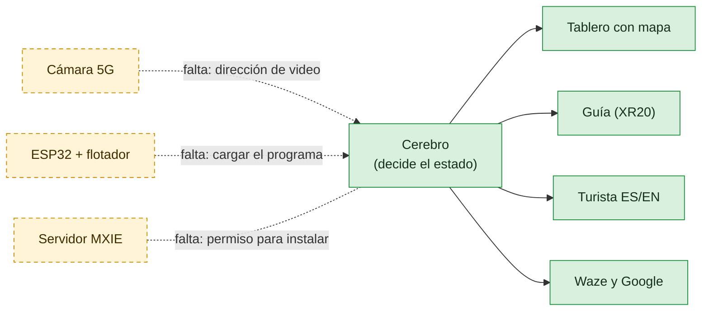

# Paso Seguro 5G · Qué tenemos y qué falta

Grupo 6 (CORA 5G) · lunes 5 de octubre de 2026

## En tres frases

1. **Ya está construido el cerebro del sistema.** Es un programa que mira el nivel del río con la cámara, decide si el cruce está LIBRE, en CUIDADO o CERRADO, y avisa al guía, al turista y a los mapas.
2. **Lo probamos completo en una laptop con un río simulado** (video y sensor de prueba). Funciona y decide en milisegundos.
3. **Falta conectarlo al equipo real del Testbed:** la cámara 5G, el servidor MXIE, el ESP32 con el flotador y los teléfonos XR20. Eso se hace el martes 6 con la PCII.



Verde: listo y probado. Amarillo: hay que conectarlo con el equipo real.

## Qué se construyó (listo)

| Pieza | Qué hace | Estado |
|---|---|---|
| **Cerebro** (servidor de borde) | Lee la cámara, mide el agua en la regla y suma el flotador y la lluvia del IMN para decidir | ✅ Probado con 134 pruebas automáticas |
| **Tablero** | Estado en grande, video, mapa del cruce, latencia en vivo y lista de eventos | ✅ Probado en el navegador |
| **Página del guía** (XR20) | Alerta con sirena, voz, vibración y video, y botón para cerrar el cruce | ✅ Probada |
| **Página del turista** | Aviso en español e inglés, para un código QR | ✅ Probada |
| **Programa del ESP32** | Lee el flotador y el sensor de agua y prende luces y zumbador. Avisa aunque no haya red. | ✅ Probado en PC · ⏳ falta probarlo en la placa |
| **Mapas** | Aviso en el formato oficial de Waze (válido) y en el de Google Maps | ✅ Validado · publicarlo requiere a un socio oficial, como el MOPT |
| **Lluvia del IMN** | Datos reales de las 8 estaciones | ✅ Funciona cuando hay internet |
| **Ensayo sin equipo** | Video y sensor simulados, más botones de demo | ✅ Listo |

## Qué falta para conectarlo (martes 6)

| # | Conexión | Qué hay que hacer | Si no se puede |
|---|---|---|---|
| 1 | Cámara 5G → cerebro | Pedir a la PCII la dirección de video (RTSP), ponerla en la configuración y calibrar con 5 clics | Webcam USB, o un XR20 como cámara |
| 2 | Cerebro → servidor MXIE | Pedir permiso para instalar nuestro programa (contenedor) y cargarlo | Una laptop conectada a la red 5G hace de servidor |
| 3 | ESP32 → red | Armar el kit, poner en el programa el Wi-Fi del CPE y la IP del servidor, cargarlo y calibrar el sensor | Avisa solo, en modo local |
| 4 | Teléfono del guía | Abrir la página del guía en el XR20 y tocar «Activar alertas». Preguntar si Team Comms se puede disparar desde un programa | La página del guía ya hace sirena, voz y video |
| 5 | Internet | Saber si la red privada tiene salida a internet (la necesita el IMN) | El aviso no depende de internet |
| 6 | Maqueta | Tubo, agua con colorante azul, regla pintada, marca magenta fija y flotador a la altura del 75 % | — |
| 7 | Medir | La latencia real por 5G desde el XR20 | — |
| 8 | Vado real | Confirmar el lugar exacto del vado del río Vainilla | El mapa lo marca como «punto de ejemplo» |

Las preguntas exactas para la PCII y el plan día por día están en [PLAN.md](PLAN.md). Cómo correrlo está en [README.md](README.md).

## Verlo funcionando hoy, sin equipo

```bash
cd tools && ./demo_sin_hardware.sh
```

Después, abrir http://localhost:8000. Para el teléfono del guía es `/guia` y para el turista, `/turista`.
