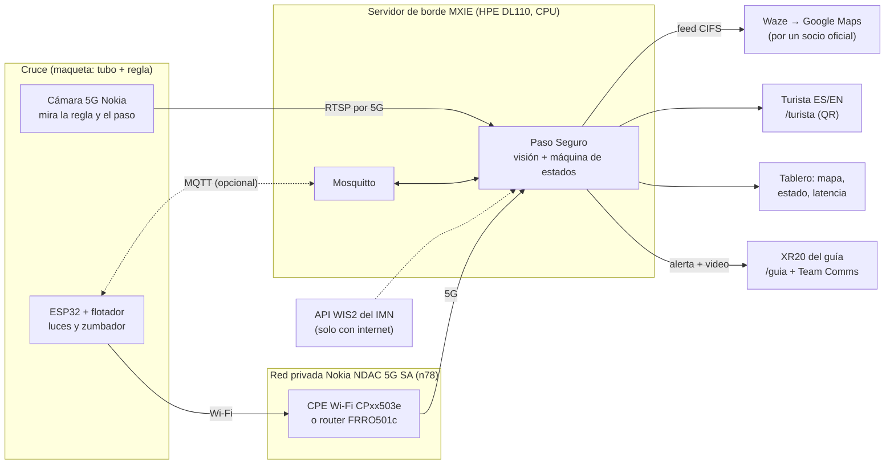

# Paso Seguro 5G · Plan de trabajo

Grupo 6 (CORA 5G) · Hackatón Centroamericano de Innovación 5G · PCII Coronado · 5 al 9 de octubre de 2026.
Versión del martes 6 de octubre: suma lo que pidieron en las charlas de la U Latina y del Grupo CCC. Todas las horas son de Costa Rica.

> **En una frase:** una cámara 5G mira el río. La IA en el servidor de borde decide en menos de un segundo si el cruce está LIBRE, en CUIDADO o CERRADO, y avisa al guía, al turista y a los mapas, aunque no haya internet.

**Tipo de propuesta: técnica con implementación.** Según las reglas del seminario del 5 de octubre, hay que demostrar el viernes el flujo completo funcionando, ojalá con equipos del Testbed, y entregar el documento técnico.

**Cómo nos evalúan** (25 % cada criterio, nota de 1 a 5):

| Criterio | Qué mostramos |
|---|---|
| Innovación | La IA en el borde decide sola y avisa con video al guía, al turista y a Waze, por una red privada 5G. |
| Pertinencia | El vado de nuestro ejemplo es real: el 7 de septiembre de 2024, el río Vainilla (Ruta 623, Lepanto) arrastró una camioneta 500 m con el conductor adentro, y la comunidad cuenta un carro arrastrado por mes. Más casos en la sección 8. |
| Viabilidad técnica | El flujo completo funcionando, 157 pruebas automáticas, latencias medidas y un plan B por equipo. |
| Escalabilidad | Un borde para muchos cruces, muchos semáforos por MQTT, el feed oficial de Waze y Google, y sensores por 5G o LoRaWAN. |

---

## Lo que pide el mentor (charlas del martes 6)

Lo dijeron el mentor de la U Latina, Luis Granados Delgado (presentación «Prototipos y Pilotaje»), y el Grupo CCC, que representa a Nokia y puso el equipo del Testbed.

**Va a preguntar a cada equipo: «¿Qué evidencia tienen de que esto debería existir?»** Nuestra respuesta, en una frase:

> En las últimas seis semanas, dos cabezas de agua mataron a un guía de turismo en el río Barú y a una turista en Rincón de la Vieja, y en el vado del río Vainilla la comunidad cuenta un carro arrastrado por mes.

Si pide una cifra nacional: la Cruz Roja contó 140 muertes por accidentes acuáticos en 2024 (ríos y mar juntos), la más alta desde 2020. Las fuentes están en la sección 8.

**La propuesta, con su plantilla** («Ayudamos a [quién] a [qué] usando 5G para lograr [impacto medible]»):

> Ayudamos a guías, turistas y conductores a saber si un cruce de río es seguro antes de llegar, usando 5G e IA en el borde, para que el aviso llegue al teléfono del guía en menos de un segundo, aunque no haya internet.

**Tres indicadores** (pidió elegir de 1 a 3):

| Indicador | Cómo se mide | Hoy |
|---|---|---|
| **Tiempo de aviso:** del agua sobre el umbral a la alerta en el teléfono del guía | El borde marca la hora de la decisión y `/guia` confirma cuándo la recibió. Meta: menos de 1 s. | 4,3 ms hasta la pantalla, en la laptop. Falta medirlo por 5G en el XR20. |
| **Precisión de la lectura del nivel** | Llenar el tubo hasta 5 marcas conocidas de la regla y anotar 10 lecturas en cada una: error medio y error máximo, en puntos de %. | Falta hacerlo con la maqueta. |
| **Costo por punto** | Equipo, conectividad y mantenimiento por cruce y por año. | Lo arma Randall. |

**Medir en el Testbed:** pidió latencia, throughput, cobertura, movilidad y confiabilidad, y demostrar con evidencia que se pueda repetir que 5G con borde aporta frente a 4G. El procedimiento está en la sección 6.

**Pitch:** 90 segundos para el problema y 90 para el flujo y los datos de impacto. Su frase: «La tecnología impresiona, el impacto convence».

**Slicing: no prometerlo.** En el laboratorio hay un solo slice, con calidad de servicio por tipo de tráfico (voz, video y datos). El slicing lo configura la operadora y, según el Grupo CCC, «en los prototipos no va a ser». Decir: **«prioridad de video y voz en la red privada; slicing con el operador cuando se escale»**.

**Viabilidad:** quién paga, quién opera y mantiene, qué regulación aplica y cómo escala en Centroamérica. Está en la sección 9.

**Sus láminas, una por una, con nuestra respuesta:**

| Lámina del mentor | Paso Seguro | Falta |
|---|---|---|
| 1. ¿Dónde está la oportunidad? «El sector es el contexto; el problema es el punto de partida» | Estamos en 3 de sus 7 sectores: turismo, movilidad y riesgos. | — |
| 2. Empezar por el problema: desafío, propuesta y métrica | La frase de evidencia, la plantilla y los 3 indicadores de arriba. | Medir los 3 indicadores en el Testbed |
| 3. MVP: qué incluir, qué no, la demo y la prueba | **Sí:** un cruce, una cámara, un sensor con flotador, el aviso al guía y el cierre en el mapa. **No:** app propia, varios cruces ni entrenar un modelo. **Demo:** entrada → procesamiento → decisión → resultado (sección 7). | **Probar con un usuario** (abajo) |
| 4. Ágil: descubrir → diseñar → construir → probar → iterar | El plan día por día y el reparto de la sección 3. | Un daily de 5 min a hora fija |
| 5. Arquitectura: «cada componente debe justificar su existencia»; «¿qué debe ocurrir en tiempo real?» | En el borde y en tiempo real: la decisión, el aviso al guía y la alarma local. Con internet: Waze y Google, la lluvia del IMN y la historia en Grafana. | — |
| 6. Viabilidad: técnica, económica, operativa, legal y datos, adopción e impacto | Sección 9. **Datos:** no identifica personas, los clips quedan en el borde y cada cambio de estado queda registrado con su hora. **Adopción:** nadie instala nada; el guía abre una página, el conductor ya usa Waze y el turista escanea un QR. | El costo por punto |
| 7. Escala en Centroamérica: «si funciona aquí, ¿qué necesitamos para llevarlo a otro país?» | Formatos estándar (Waze CIFS y MQTT), equipos 3GPP, funciona sin internet y en zona rural, y hay casos en Honduras y Guatemala. | Nombrar los aliados: el CEPREDENAC (SICA) y la agencia de emergencias de cada país (CNE, COPECO, CONRED) |
| 8. Integración con el Testbed: validar, experimentar y medir | La sección 6: 5G frente a 4G, cobertura, movilidad y confiabilidad. | Las mediciones reales y el throughput |
| 9. ¿Qué hace que un prototipo destaque? | Problema real, demo fácil de entender, 5G justificado, viabilidad y escala. | La historia de 3 minutos, ensayada |

**Prueba con un usuario** (lámina 3: «probar con usuarios, medir y ajustar»): alguien que no conozca el sistema hace de guía con el XR20. Se pasa el cruce a CERRADO y se mide cuántos segundos tarda en decir qué hay que hacer. Después, tres preguntas: ¿qué entendió?, ¿qué le faltó?, ¿lo usaría con un grupo? Mejor si es un guía de turismo de verdad.

---

## 0. Lo que ya está listo (lunes 5)

- **Servidor de borde** completo en Python 3.11 con FastAPI y **157 tests en verde**. Una revisión independiente encontró problemas (el más serio: al reiniciarse con el cruce cerrado podía reabrirlo); todos están corregidos y cubiertos por tests.
- **Probado de punta a punta en una laptop, sin hardware.** El video de prueba entra por la red, la visión mide el nivel, la máquina decide y salen el tablero, la página del guía, la del turista y los feeds.
- **ESP32:** el sketch compila en PC y habló de verdad con el borde por HTTP y con un broker por MQTT.
- **Datos reales del IMN** leídos hoy. La API **sí trae lluvia hora por hora**; el tablero del grupo decía que no.
- **Feed de Waze:** el JSON cumple la spec CIFS y el XML pasa contra el **XSD oficial de Waze**.
- **Latencias medidas en la laptop (todavía sin 5G):**
  - ida y vuelta al borde: 2,5 ms;
  - «el agua sube → la alerta llega a la pantalla»: 4,3 ms;
  - análisis de un cuadro: 1,5 ms;
  - del cuadro a la decisión: 37 ms (p50).
- **Martes 6, ya en la red 5G:**
  - la laptop-borde entró por el CPE y `tools/prueba_conectividad.sh` dio OK en los tres pasos: la ruta va por el equipo 5G, sale a internet por RACSA y el borde responde;
  - el programa del Arduino UNO con Ethernet Shield está cargado en la placa; falta cablear el sensor y ver que sus datos lleguen al borde.

Lo que falta probar con el equipo del Testbed está en la sección 4.

---

## 1. Arquitectura

**Flujo, con las marcas de tiempo que se miden:**

1. La cámara manda video por RTSP. El borde guarda solo el cuadro más reciente (`t_captura`).
2. La visión busca el agua teñida en la regla: 1,5 ms por cuadro en CPU, más una mediana de 3 cuadros para que una mano frente al tubo no cierre el cruce.
3. La máquina de estados junta seis entradas y produce la decisión (`t_decision`):
   - la cámara, que es la fuente principal;
   - el sensor del ESP32, de respaldo;
   - el flotador, que manda CERRADO;
   - la velocidad de subida;
   - la lluvia del IMN;
   - el cierre manual.
4. Las salidas:
   - el tablero, el guía y el turista reciben la alerta al instante (SSE);
   - el ESP32 recibe el estado en la respuesta HTTP o por MQTT y prende sus luces;
   - se actualizan los feeds de Waze y Google y los webhooks;
   - PTT/PTV queda como stub.
5. La página del guía confirma sola que recibió la alerta (`t_recibido`). Así se mide la entrega real al teléfono.

**Reglas de la máquina de estados** (umbrales del kit del grupo):

| Entrada | Sube a CUIDADO | Sube a CERRADO | Para bajar |
|---|---|---|---|
| Nivel (cámara o sensor) | ≥ 40 % | ≥ 70 % | Quedar 10 puntos bajo el umbral 30 s seguidos (demo; en un río real, 15 min o más). Baja de a un escalón. |
| Velocidad de subida | ≥ 15 %/min, aunque el nivel sea bajo | — | — |
| Flotador | — | Al instante (respaldo físico) | — |
| Lluvia del IMN | ≥ 10 mm en 1 h o ≥ 25 mm en 3 h | — | — |
| Sin datos | Sube a CUIDADO | Si ya estaba CERRADO, se queda | Nunca baja sin datos |
| Cámara y sensor no coinciden (más de 30 puntos) | Manda la lectura más alta (el peor caso) y se marca la discrepancia | | |
| Reinicio del borde | Retoma el estado que había antes de apagarse | | Sigue la regla normal de bajada |
| Cierre manual (guía u operador) | Puede subir | Puede subir | **Nunca puede abrir un cruce en peligro** |

> **Ojo con una frase de la presentación:** «no ponemos Wi-Fi en el camino crítico». El ESP32 solo tiene Wi-Fi.
> Mejor decir: **«el camino crítico (cámara → borde → guía) va por 5G; el ESP32 es respaldo y su alarma local no depende de ninguna red»**.

---

## 2. Qué corre en cada equipo del Testbed

| Equipo | Qué hace en Paso Seguro | Plan B |
|---|---|---|
| **MXIE** (HPE DL110, 20 vCPU, sin GPU) | Dos contenedores: el borde (visión, decisión, tablero y feeds) y Mosquitto. La visión usa CPU: 1,5 ms por cuadro. | Una laptop del equipo hace de borde, conectada a la red 5G por el CPE o el dongle. Es el mismo código. |
| **Cámara 5G Nokia** | Video RTSP de la regla y del paso. El Grupo CCC la paseó en carro con video en tiempo real; la antena exterior cubre unos 500 m. | Webcam USB en la laptop-borde, el XR20 como cámara IP o `tools/relay_camara.py` |
| **NDAC 5G SA n78** (MicroRRH exterior + 2 pico) | Lleva video, sensor y alertas dentro del campus. Tiene un solo slice, con prioridad por tipo de tráfico (voz, video y datos). | Wi-Fi local del CPE (y decirlo en el pitch) |
| **CPE con Wi-Fi CPxx503e** | Wi-Fi para el ESP32 (que no tiene 5G), con salida por 5G. En la inducción, la PCII mostró sensores conectados por dongle: **los equipos no tienen que ser 5G**. | Router interior FRRx502e o el hotspot del XR20 |
| **Router exterior FRRO501c** (IP67) | El «sitio del río» afuera, si la maqueta va al exterior | CPE adentro |
| **Dongle DGRx501e** | Por cable de red da IP por DHCP (192.168.225.x, puerta de enlace .1). La PCII ya conectó así un Arduino con Ethernet Shield. Sirve para la laptop-borde o la del tablero. | Wi-Fi |
| **2 × Nokia XR20** | 1: el guía, con `/guia` (voz, sirena, vibración, video) y Team Comms. 2: cámara IP de respaldo o pantalla del turista. | Teléfonos propios n78 SA con las SIM del Testbed |
| **Team Comms PTT/PTV** (10 licencias) | Voz y video de misión crítica al guía | `/guia` con voz sintética y video en vivo, o una persona en la consola de despacho |
| **100 SIM** | Identidad de cada equipo: cámara, CPE, XR20 y dongle | — |
| **NIDM** | Estado de routers, CPE y dongle en la consola de la PCII | Nuestro tablero |
| **NDAC Manager y Gemelo Digital** | Mostrar la red y los equipos en el pitch. Presentar el cruce como **gemelo digital**, que la inducción define como «copia virtual de un equipo que se actualiza con lecturas reales para mostrar su estado en tiempo real y predecir requerimientos». El tablero ya lo hace: lecturas reales y alerta por subida rápida. | Nuestro tablero como gemelo del cruce |

---

## 3. Plan día por día y reparto de tareas

**Lunes 5: validación con el comité**
- Si piden ver algo, mostrar la demo sin hardware: `tools/demo_sin_hardware.sh`.
- Hacerle a la PCII las preguntas de la sección 4 y anotar las respuestas aquí.
- Armar la maqueta:
  - tubo con agua teñida de azul fuerte;
  - regla pintada con franjas verde, amarilla y roja;
  - una marca magenta fija arriba;
  - fondo blanco mate y luz fija;
  - flotador a la altura del 75 %.
- Repartir tareas (tabla de abajo).

**Martes 6 (hoy): integración en la red 5G** (Stuart presencial)
- Temprano: una persona del grupo se reporta con Carlos (CeNAT) para que asigne la estación de trabajo según cuántos van presenciales.
- Mañana:
  - correr `tools/prueba_conectividad.sh` con la laptop por cable al dongle y el Wi-Fi apagado: comprueba la ruta, la salida por RACSA y el borde;
  - conectar la cámara 5G por RTSP al borde (MXIE o laptop) y calibrar en `/calibrar` (5 clics);
  - conectar el ESP32 al Wi-Fi del CPE y ver que su POST llegue al borde;
  - probar el modo local: desconectar el ESP32 y ver que la alarma siga.
- Medir la latencia base desde la laptop con dongle (`tools/medir_latencia.py`) y desde el XR20 (`/guia`).
- **16:00 — corte:** decidir plan A o B para cada punto de la sección 4.
- 17:00: mentoría (hora de oído en el seminario; confirmarla).

**Miércoles 7: alertas y mapas**
- PTT/PTV: la API o el plan B (`/guia` con voz y video).
- Mostrar los feeds de Waze y Google en el tablero (ya validan).
- Ensayo completo 1 de la demo, con cronómetro.
- **Grabar el video de respaldo** de la demo completa (primera versión).

**Jueves 8: entrega al jurado** (Randall presencial)
- Entregables: documento técnico con los diagramas (arquitectura, latencias medidas, planes B y costo por punto), idea de negocio, presentación del pitch y **video del prototipo**, que piden por si la demo no se puede mostrar en vivo.
- 14:00 — congelar el código: desde ahí, solo arreglos.
- Grabar la versión final del video con el código congelado.
- Ensayos 2 y 3, incluida la prueba «sin internet».

**Viernes 9, 9:30: pitch** (15 min por equipo: 10 de pitch con propuesta de valor, diseño, tecnología y demo; el resto, preguntas del jurado)
- Montaje temprano.
- Checklist:
  - borde arriba (`/salud`);
  - cámara calibrada;
  - ESP32 en modo «borde»;
  - XR20 en `/guia` con las alertas activadas;
  - video de respaldo abierto.

**Reparto sugerido** (por las habilidades que figuran en el tablero del grupo; ajustarlo entre todos):

| Persona | Tarea principal | Apoyo |
|---|---|---|
| Wlady | Borde (MXIE o laptop), integración y tablero | n8n de prueba, si se usa |
| Jorge | ESP32, maqueta, umbrales y pruebas de falla | Calibración de la cámara |
| Eddy | IMN y feeds de Waze y Google; documento de datos públicos | Seguridad |
| Stuart | Preguntas a la PCII (martes); modelo de negocio: quién paga | Pitch |
| Randall | Costo por punto y escalabilidad; entrega del jueves | Pitch |
| Aina | Historia, láminas, video de respaldo y mensajes ES/EN | Página del turista (QR) |

---

## 4. Preguntas para la PCII, con plan B

| # | Pregunta | Plan B si la respuesta es no |
|---|---|---|
| 1 | ¿Podemos correr contenedores propios (Docker o Kubernetes) en el MXIE? ¿Con qué acceso: SSH, consola o registro de imágenes? | Laptop como borde dentro de la red 5G (dongle o CPE). Mismo código. |
| 2 | ¿La cámara 5G da un stream RTSP? Necesitamos URL, usuario, códec (H.264 o H.265), resolución y fps. ¿O solo va a una plataforma Nokia? | Webcam USB en la laptop-borde, el XR20 como cámara IP o `relay_camara.py` |
| 3 | ¿Team Comms tiene API o consola de despacho para disparar PTT o PTV y mandar video desde un programa? | `/guia` en el XR20 (voz sintética, sirena y video), o una persona en la consola de despacho |
| 4 | **Respondida.** El NDAC sale a internet por RACSA, aparte de la red de la PCII (informe NDAC v4), y el martes 6 el Grupo CCC dijo que la salida está «totalmente abierta», sin puertos ni protocolos bloqueados. La laptop lo confirmó con `prueba_conectividad.sh`. Sigue abierto lo de entrada: que el XR20 y el ESP32 lleguen al borde (riesgo del NAT, sección 5). | Sin internet, el IMN sale de la caché y Waze se muestra local. **Justo eso es lo que queremos demostrar.** |
| 5 | ¿Podemos usar teléfonos propios n78 SA con las SIM del Testbed? | Solo los 2 XR20, más el Wi-Fi del CPE |
| 6 | **Respondida en parte (Grupo CCC, martes 6):** en el laboratorio hay un solo slice, con calidad de servicio por tipo de tráfico (voz, video y datos), y el slicing lo configura la operadora. Falta preguntar si la cámara y las alertas van con la prioridad de video y si la red se puede configurar para que suba más de lo que baja. | No prometer slicing. Decir «prioridad de video y voz en la red privada; slicing con el operador cuando se escale» |
| 7 | ¿Qué IP tendrán el borde, la cámara y los equipos? ¿Hay DHCP? ¿Podemos fijar IP? | IP fija en la laptop-borde |
| 8 | ¿Dónde está la MicroRRH exterior? ¿Podemos montar la maqueta afuera? Según el Grupo CCC, la antena exterior cubre unos 500 m. | Demo adentro, con las radios pico |
| 9 | ¿NIDM acepta equipos propios (MQTT o LwM2M)? | Nuestro Mosquitto en el borde |
| 10 | ¿A qué hora y en qué formato se entrega el jueves? ¿Hay mesa y corriente para montar el viernes? | Llevar regleta, batería USB y el video de respaldo |
| 11 | ¿Podemos mostrar el cruce en su plataforma de gemelo digital (devsim.konectasentinel.com o el Nokia Digital Twin)? ¿Acepta datos por API o MQTT? | Nuestro tablero hace de gemelo digital del cruce |
| 12 | El permiso experimental obliga a informar al ministerio qué equipos se usan en la red. ¿Qué hay que registrar de lo nuestro (kit ESP32 por el CPE, laptop con dongle, SIM) y quién lo hace? | Usar solo equipos del Testbed ya registrados |
| 13 | El sensor Dragino DDS75-LB (LoRaWAN) que vimos: ¿de quién es, en qué gateway y servidor LoRaWAN está registrado y nos pueden pasar sus datos por MQTT o webhook? | Seguimos con la cámara y el ESP32 |
| 14 | ¿Nos dan un usuario en el Mosquitto de su Caso de Uso 0 (solo para `pcii/ndac/pasoseguro/#`) y una base `pasoseguro_db`, para guardar la historia del cruce y verla en su Grafana? | InfluxDB propio, o solo nuestro tablero |

---

## 5. Riesgos

| Riesgo | Probabilidad | Impacto | Qué hacemos |
|---|---|---|---|
| No hay acceso al stream de la cámara 5G | Media | Alto | Webcam USB o el XR20 como cámara; el resto del sistema no cambia |
| No se puede desplegar en el MXIE | Media | Medio | Laptop-borde dentro de la red 5G |
| El XR20 o el ESP32 no alcanzan una laptop-borde detrás del NAT del dongle o del CPE | Media | Alto | Borde en el MXIE, puerto 8000 abierto en el dongle, o el borde y el ESP32 en la misma red del CPE |
| Team Comms no tiene API | Alta | Medio | `/guia` en el XR20, más la consola manejada a mano |
| Reflejos o cambios de luz alteran el color | Media | Alto | Colorante fuerte, fondo mate, luz fija y marca de referencia; recalibrar en el lugar. **La IA avisa cuando no ve.** |
| Falla en vivo durante el pitch | Media | Alto | Video de respaldo, simulador y botones del modo demo |
| No hay internet el día del pitch | Baja: sale por RACSA, sin puertos bloqueados, y ya lo probamos | Bajo | El aviso no depende de internet; el IMN sale de la caché |
| El ESP32 no se conecta al Wi-Fi del CPE | Media | Bajo | Modo local con luces y zumbador; hotspot del XR20 |
| Falsos cierres por manos o personas frente al tubo | Media | Medio | Mediana de 3 cuadros y una zona de personas separada |
| El jurado pregunta «¿y en un río real?» | Alta | Medio | Sensor de nivel por radar, panel solar y 5G (FWA, red privada o la red portátil de un operador regional). Paso Seguro aporta la decisión y los avisos. |
| No están confirmadas las coordenadas del vado | Alta | Bajo | El mapa dice «punto de ejemplo»; confirmar con la comunidad o el MOPT |
| Waze rechaza el cierre | Media | Bajo | Solo en vías vehiculares, con el mismo nombre de calle y entre 30 m y 20 km; probarlo con el socio oficial |

---

## 6. Latencia: cómo medirla y mostrarla en vivo

El tablero tiene un panel **«Latencia medida en vivo»** que muestra p50 y p95 de cada tramo:

| Tramo | Cómo se mide |
|---|---|
| Esta pantalla ↔ borde | La página llama a `/ping` cada segundo. |
| **Teléfono del guía ↔ borde** | `/guia` en el XR20 mide `/ping` y lo informa al borde. **Es el número 5G para el pitch.** |
| Cámara → decisión | Desde que el cuadro llega al borde hasta la decisión. |
| Análisis del cuadro | Tiempo de CPU de la visión. |
| ESP32 ↔ borde | El ESP32 cronometra su POST y lo manda en el siguiente. |
| Alerta → teléfono del guía | De la decisión a la recepción en `/guia`, con el reloj corregido por `/ping`. |
| Borde → internet | Comparación con un servidor en la nube. |

**Medido hoy en una laptop, sin 5G** (sirve de referencia, no como cifra del pitch):

| Tramo | p50 | p95 |
|---|---|---|
| Esta pantalla ↔ borde | 2,5 ms | 2,6 ms |
| Acción → alerta en pantalla | 4,3 ms | 4,5 ms |
| Análisis del cuadro | 1,5 ms | 5 ms |
| Cámara → decisión | 37 ms | 69 ms |
| ESP32 ↔ borde (HTTP) | 2–3 ms | — |
| Borde → internet | 215 ms | — |

**El martes, en la red 5G:**
- Desde la laptop con el dongle:
  `tools/medir_latencia.py --borde http://IP-BORDE:8000 -n 200 --comparar https://www.google.com/generate_204`
- Desde el XR20: abrir `/guia?id=xr20-guia` y dejarlo 2 minutos.
- Repetir por Wi-Fi para comparar.

**5G frente a 4G (lo pidió el mentor).** La comparación es **5G privado con borde** contra **4G pública con nube**: el mismo comando, 200 muestras, y cada salida guardada con `| tee` para que cualquiera la pueda repetir.
1. **5G con borde:** el número del XR20 en `/guia` y, desde una laptop con el dongle:
   `tools/medir_latencia.py --borde http://IP-BORDE:8000 -n 200 --comparar https://www.google.com/generate_204 | tee latencia-5g.txt`
2. **4G con nube:** una laptop por el hotspot 4G de un teléfono, con el borde corriendo en esa misma laptop. Vale la línea «Compara»:
   `tools/medir_latencia.py -n 200 --comparar https://www.google.com/generate_204 | tee latencia-4g.txt`
3. **Cobertura y movilidad:** caminar con el XR20 y `/guia` abierta, alejándose de la antena, y anotar dónde sube la latencia o se corta. Según el Grupo CCC, la antena exterior cubre unos 500 m.
4. **Confiabilidad:** contar los pings perdidos (el script escribe «fallo») y las alertas que llegaron al XR20 frente a las que mandó el borde.
5. **Throughput:** la subida del video de la cámara al borde. Todavía no tenemos herramienta; preguntar a la PCII si NDAC Manager lo muestra.

**Video de vidrio a vidrio (cámara → pantalla):**
1. Poner un cronómetro con milisegundos frente a la cámara 5G.
2. Al lado, la pantalla con el video en vivo del tablero.
3. Tomar una foto donde se vean las dos cosas.
4. La diferencia entre los dos relojes es la latencia total del video.

**En el pitch:** se ve una sola cifra grande, la del teléfono del guía, y al lado la comparación «borde X ms vs nube Y ms». Después se corta internet y la cifra local no cambia.

---

## 7. Pitch y guion de la demo

**Orden del pitch** (10 min; ajustarlo en el ensayo con cronómetro):
1. **1:30, el problema:** la frase de evidencia y unos segundos de uno de los videos de la sección 8.
2. **1:30, el flujo y el impacto:** cámara → borde → guía, y los tres indicadores con lo medido.
3. **3:00, la demo** (guion abajo).
4. **El resto:** 5G frente a 4G con lo medido, quién paga y quién opera, y la escala.

**Guion de la demo:**

1. **LIBRE:** tablero en verde; se ve la latencia 5G del XR20.
2. **Se echa agua:** pasa a **CUIDADO por subida rápida**, antes del umbral (alerta temprana).
3. **Sigue subiendo:** pasa a **CERRADO**.
   - suena el ESP32;
   - el XR20 del guía recibe la alerta con voz y con el clip de video;
   - el turista lee el aviso en español e inglés;
   - el mapa se pone en rojo;
   - el feed de Waze queda válido.
4. **Alguien camina hacia el «río»:** llega una segunda alerta, «persona en el cruce».
5. **Se corta internet:** todo sigue igual; el tablero muestra «Internet: NO» y la latencia no cambia.
6. *(Si sobra tiempo)* **Se baja el agua:** el cruce reabre de a un escalón, no de golpe.

### Preguntas del jurado: respuestas cortas

La inducción del Testbed tiene una lámina entera titulada «Sí, pero todo eso se puede hacer sin 5G…», así que la van a hacer. También nombra dos desafíos: el costo y la IA que aproveche los datos.

**Jurado** (nombres de oído, por confirmar): la coordinadora de la PCII (preside), un representante de la Unión Europea, una persona del MICITT, un colaborador del proyecto y un experto de CAMTIC en IoT y 5G.

**«¿Esto se puede hacer sin 5G?»**

> La alarma del cruce no necesita 5G, y es a propósito: si todo se cae, igual avisa. Lo que sí necesita 5G es subir video en vivo desde un río sin cable ni Wi-Fi, analizarlo en el borde en milisegundos y mandárselo al guía con prioridad, por una red privada que no se comparte con nadie. Sin 5G queda un sensor que pita; con 5G, el guía ve el río antes de llegar.

| Pieza | ¿Necesita 5G? | Por qué |
|---|---|---|
| Alarma en el cruce (ESP32: luces, zumbador y flotador) | No, a propósito | Tiene que avisar aunque se caiga toda la red. |
| Decisión en el borde | No | Corre en el MXIE o en una laptop. Lo que importa es que esté cerca del río y no en la nube. |
| Video de la cámara al borde | **Sí** | Video en vivo desde un sitio sin cable: necesita subida ancha y estable a cientos de metros (la antena exterior del Testbed cubre unos 500 m). El Wi-Fi no llega, y la red pública no garantiza cobertura ni prioridad en un cruce rural. La red privada se puede configurar para que suba más de lo que baja, que es justo lo que pide una cámara. |
| Alerta con video al guía (XR20, Team Comms) | **Sí** | Video de misión crítica a un teléfono en movimiento. Necesita prioridad sobre el resto del tráfico, y eso lo da la red privada. |
| Muchos sensores a lo largo del río | Ayuda | 5G conecta miles de sensores por km² (mMTC). Los sensores a batería también pueden ir por LoRaWAN, como el Dragino. |
| Waze, Google Maps e IMN | No | Necesitan internet, cualquiera. |

El ejemplo que ellos mismos usan: la red privada de la Isla del Coco, con cámaras trampa en una zona remota sin operador nacional.

**«¿Todos los equipos tienen que ser 5G?»** No. Víctor (Promotora) mostró un sensor con Arduino conectado por el router o el dongle 5G. El ESP32 entra igual, por el CPE o el dongle.

**«¿Dónde está la IA?»** En el borde. La visión mide el nivel en la regla, detecta si alguien entra al cruce y avisa cuando no ve bien (poca luz, sin contraste o sin la marca de referencia). Corre en CPU, sin GPU: 1,5 ms por cuadro.

**«¿Y el slicing?»** No lo prometemos. En el laboratorio hay un solo slice, con prioridad por tipo de tráfico: el video y la voz van primero. El slicing de verdad lo configura la operadora y es para cuando se escale. El mentor lo explicó como un carril reservado para el personal de salud en un terremoto; en una crecida, sería el carril de los cuerpos de emergencia.

**«¿Cuánto cuesta?»** El software corre en CPU, sin GPU ni nube. El costo por punto lo arma Randall. Referencias de hoy en San José (CRCibernética): sensor ultrasónico impermeable a $19,95 y sensor sumergible de 0 a 6 m a $72,95.

---

## 8. Hallazgos verificados hoy

**IMN** ([API WIS2](http://wis2box.imn.ac.cr/oapi)):
- Tiene 8 estaciones y la lluvia viene hora por hora (`total_precipitation_or_total_water_equivalent`, en mm).
- Para pedir los datos ordenados hay que usar `sortby=-reportTime`; con `-phenomenonTime` el servidor responde error.
- La estación más cercana al vado es **Finca La Ceiba, a 25,6 km**. Para un cruce real hace falta un pluviómetro local.
- Dato real para el pitch: **ayer, 4 de octubre, cayeron 40,4 mm entre las 15:00 y las 16:00 en el aeropuerto de Liberia** (Daniel Oduber).

**Waze CIFS** ([spec](https://developers.google.com/waze/data-feed/cifs-specification), [XSD](https://www.gstatic.com/road-incidents/cifsv2.xsd)):
- Waze no acepta cierres en vías peatonales. El vado (vehicular) va al feed; el cañón (sendero) va solo al guía y al turista.
- La polilínea tiene que tener entre 30 m y 20 km y quedar sobre una sola calle.
- El `starttime` no se cambia una vez que el cierre está activo, y el `endtime` no se calcula a partir de la hora actual.
- Sin `endtime`, Waze asume 14 días. Por eso el borde estima el fin en bloques de 3 h y al reabrir fija la hora real.
- Waze lee la URL cada pocos minutos y solo acepta feeds de socios de Waze for Cities.

**Google Maps** ([ayuda de Google Maps Content Partners](https://support.google.com/mapcontentpartners/answer/144284)):
- Los cierres que entran a Waze por el feed **pasan solos a Google Maps**: 15–25 min para uno nuevo y hasta 1–2 h para un cambio.
- La carga directa (GeoJSON con `TYPE`, `POLYLINE`, `DIRECTION`, `START_TIME` y `END_TIME`) sirve para cierres puntuales, pero **no tiene tipo «inundación»**.

**MOPT y Waze:**
- Según la prensa ([El Financiero, 2014](https://www.elfinancierocr.com/tecnologia/transito-se-alimentara-de-datos-de-waze-para-atender-choques-y-presas/S54SEXYRN5AONAPYRBTIQ6OI6M/story/)), hay un acuerdo desde 2014, y el [MOPT lo menciona en 2025](https://www.mopt.go.cr/noticias/2025/inicia-reconstruccion-de-puente-sobre-el-rio-maria-aguilar-rn-39-circunvalacion).
- No encontré si hoy el MOPT envía un feed CIFS.

**Evidencia de casos reales** (para la pertinencia; verificados el 6 de octubre):

| Fecha | Lugar | Qué pasó | Fuente |
|---|---|---|---|
| 7-sep-2024 | Río Vainilla, Ruta 623, Lepanto (Puntarenas) | Un conductor intentó cruzar el vado crecido. La corriente arrastró su camioneta unos 500 m y lo sacó de la cabina; lo ayudaron dos vecinos y atendió la Cruz Roja. Según la comunidad, se atascan 2 o 3 carros por semana, uno es arrastrado cada mes y las ambulancias tienen que dar una vuelta de 2 h cuando el río crece. Unas 500 personas dependen de esa ruta y piden un puente desde hace años. | [La Nación](https://www.nacion.com/sucesos/desastres/dueno-de-carro-arrastrado-en-rio-de-lepanto-cuenta/LKUXZKLPFVEXPIGVG26SPPY7ME/story/) |
| 30-ago-2026 | Río Barú, Pérez Zeledón | Una cabeza de agua sorprendió a un tour de más de 25 personas. Murió el guía y rescataron a más de 20. | [Teletica](https://www.teletica.com/sucesos/encuentran-sin-vida-a-guia-que-fue-arrastrado-por-cabeza-de-agua_416369) |
| 12-sep-2026 | Catarata Oropéndola, Rincón de la Vieja (fuera del límite del parque, según el SINAC) | Cabeza de agua: cinco personas quedaron a salvo y murió una turista estadounidense. | [El Observador](https://observador.cr/emergencia-en-parque-nacional-rincon-de-la-vieja-5-personas-estan-en-zona-segura-y-una-mujer-sigue-extraviada/) · [CRHoy](https://crhoy.com/nacionales/estadounidense-es-la-victima-mortal-de-cabeza-de-agua-en-guanacaste/) |
| 4-may-2026 | Río Costa Rica, Guápiles | Una crecida repentina arrastró a personas que estaban en la orilla. Murió un hombre. | [El Observador](https://observador.cr/video-hallan-sin-vida-a-hombre-arrastrado-por-cabeza-de-agua-en-guapiles/) |
| 9-nov-2025 | Catarata Las Trillizas, Santa Cruz de Turrialba | Dos adultos quedaron atrapados al otro lado del río por la crecida. Hubo rescate de Cruz Roja y Bomberos. | [Telediario](https://www.telediario.cr/en-alerta/rescate-cataratas-adultos-atrapados-cruzar-rio) |
| 8-ago-2022 | La Marina, San Carlos | Un río arrastró un carro y los bomberos sacaron al conductor. Esa noche la Cruz Roja atendió 75 incidentes por lluvia. | [CRHoy](https://www.crhoy.com/nacionales/asi-quedo-carro-arrastrado-por-rio-en-san-carlos-cruz-roja-reporto-75-incidentes-por-lluvias/) |
| 4-nov-2019 | Río Toro, catarata La Gata, San Carlos | Una cabeza de agua alcanzó a un grupo de unas 20 personas. Murieron tres jóvenes. | [CRHoy](https://crhoy.com/sitio-en-que-murieron-3-amigas-es-un-lugar-espectacular-pero-muy-peligroso/) |

- **El mismo fin de semana del 7 y 8 de septiembre de 2024**, la corriente se llevó al menos tres vehículos en Lepanto y en Nandayure, el cantón vecino.
- **Videos para el pitch** (con la fuente en pantalla y solo unos segundos):
  - Lepanto, río Vainilla, 7-sep-2024: fotos y video de la camioneta arrastrada ([CRHoy](https://www.crhoy.com/nacionales/fotos-asi-encontraron-carro-que-se-llevo-la-corriente-en-lepanto/)).
  - Nandayure, 7-sep-2024: amarran un carro con una cuerda, la cuerda cede y el río se lo lleva ([CRHoy](https://www.crhoy.com/video-de-rodillas-y-desconsolado-hombre-ve-como-el-rio-se-lleva-carro-en-guanacaste/); otro video del cantón en [YouTube](https://www.youtube.com/watch?v=mKO-3bMA9gA)).
  - Nandayure, Ruta 21, septiembre de 2024: una cabeza de agua arrastra un camión cargado de naranjas ([Teletica](https://www.teletica.com/sucesos/video-camion-es-arrastrado-por-cabeza-de-agua_366712)).
  - Lepanto, Montaña Grande, 14-nov-2024: un carro arrastrado al cruzar el río; el conductor salió ileso ([Puntarenas Se Oye](https://www.puntarenasseoye.com/puntarenas/regionales/video-intento-de-cruce-de-rio-en-lepanto-termina-en-rescate/)).
  - Pozos de Santa Ana, 3-may-2026: dos personas atrapadas en un 4×4 por una crecida; las rescata la Policía Municipal ([Teletica](https://www.teletica.com/sucesos/video-dos-personas-quedan-atrapadas-en-un-vehiculo-por-crecida-en-santa-ana_408094)).
  - En la región: el río Cuyamapa, en Yoro (Honduras), arrastra un vehículo el 25-sep-2026 ([La Tribuna](https://www.latribuna.hn/2026/09/25/vehiculo-es-arrastrado-por-crecida-del-rio-cuyamapa-en-yoro-video/)).
- **Cifras de la Cruz Roja** (muertes por accidentes acuáticos, ríos y mar juntos): 96 en 2020, 108 en 2021, 119 en 2022, 132 en 2023 y 140 en 2024 ([El Observador](https://observador.cr/2024-rompe-record-de-muertes-por-accidentes-acuaticos-en-los-ultimos-cuatro-anos-segun-cruz-roja/)).
- **En la región**, según los titulares: en Yoro, Honduras, un carro fue arrastrado al cruzar un río crecido el 25 de septiembre de 2026 ([Tu Nota](https://www.tunota.com/honduras-hoy/carro-intento-cruzar-rio-y-fue-arrastrado-2026-09-25)), y en Guatemala una correntada arrastró un bus con 20 pasajeros el 16 de agosto de 2026 ([Infobae](https://www.infobae.com/guatemala/2026/08/16/momentos-de-terror-en-guatemala-luego-que-un-bus-fuera-arrastrado-por-una-correntada-con-20-pasajeros-a-bordo/)).

**El vado:**
- La Nación (14 de septiembre de 2024) lo ubica en el río Vainilla, sobre la Ruta 623, en Pilas de Canjel (Lepanto, Puntarenas). Es el vado del primer caso de la tabla.
- En OpenStreetMap no existe ningún «río Vainilla». Como punto de ejemplo quedó el cruce sin puente de la Vía 623 sobre la «Quebrada Lajas» (9,908952, −85,206468). **Falta mover el punto al vado del Vainilla, con coordenadas confirmadas.**

**Informes NDAC de la PCII** (v2, v3 y v4, agosto de 2026, Unidad de TI):
- El NDAC sale a internet por RACSA, aparte de la red y del firewall de la PCII (v4).
- Ya funciona esta cadena con datos reales cada segundo: Arduino UNO con Ethernet Shield → dongle → NDAC → internet → Mosquitto → Node-RED → MariaDB → Grafana (v4). El servidor se pensó para varios proyectos, con una base y un usuario por proyecto (v2).
- El dongle da IP por DHCP en 192.168.225.x, con puerta de enlace .1 (v4).
- **NAT loopback:** desde el Wi-Fi de la PCII no se llega a sus propios servicios por la IP pública. Las pruebas hacia su Mosquitto se hacen desde la red NDAC o desde afuera (v4).
- **Arduino UNO:** `snprintf` no imprime decimales (con `%f` sale un «?»), así que hay que usar `dtostrf()` (v4). Además, PubSubClient publica solo con QoS 0 (v2).
- **Zona horaria:** el nodo MySQL de Node-RED va en -06:00 y la fuente MySQL de Grafana en +00:00. Si no, la hora sale corrida 6 h (v3).
- Los informes v3 y v4 traen escrita la contraseña de un usuario MQTT de la PCII. No hay que copiarla; conviene avisarles para que la cambien.

**OpenCV en Mac:**
- La versión de pip para Mac no trae FFmpeg y por eso no lee RTSP. En Linux y Docker sí.
- En laptops, el borde usa PyAV automáticamente.

---

## 9. Continuidad, viabilidad y quién paga

Es para la ruta después del hackatón. El modelo de negocio lo arma Stuart; esto es lo que mostraron la Promotora (inducción del lunes 5), el mentor de la U Latina y el Grupo CCC (martes 6).

**Lo que pidió el mentor, con nuestra propuesta:**
- **Quién paga:** un costo por cruce y por año. Sale del costo por punto que arma Randall.
- **Quién opera y mantiene:** la municipalidad o el MOPT en los vados de caminos, la CNE en la emergencia y el operador turístico en sus senderos.
- **Regulación:** la CNE (alertas y emergencias), el MOPT (cierres de vías y el feed de Waze), y el MICITT y la SUTEL (espectro y redes privadas).
- **Escala en Centroamérica:** el feed de Waze usa un formato estándar (CIFS) y las alertas salen por MQTT y webhooks. Según el Grupo CCC, todo el Testbed cumple 3GPP: lo que funciona en la red privada funciona después en una red pública. Los casos de Honduras y Guatemala de la sección 8 muestran el mismo problema en la región.
- **Nodo de emergencia:** el Grupo CCC puso como ejemplo de solución crítica a la CNE o a los bomberos levantando un nodo propio, al que se conectan todos los cuerpos de emergencia sin depender de la red pública. Encaja con Paso Seguro y con la red portátil del operador regional (abajo).
- **Seguir después del hackatón:** la U Latina tiene un testbed 5G sobre red pública en Heredia, con banda alta y baja, y ofreció seguir los pilotos con la Promotora. Ahí se puede probar Paso Seguro en una red pública.

**Lo de la Promotora:**

- **Dónde seguir probando:** la Promotora presenta el Testbed como una «plataforma experimental de triple hélice (Academia-Industria-Gobierno) para probar tecnologías y servicios previo a la implementación a gran escala». Paso Seguro puede seguir ahí como piloto.
- **Proyectos de la Promotora en 2026 que encajan:**
  - Convenio INDER–Promotora (LINC y CECI rurales): trabaja en territorios rurales, donde están los cruces.
  - Compra Pública Innovadora (mapa de demanda temprana y capacitación): es el camino para que una entidad pública, como una municipalidad, la CNE o el MOPT, compre una solución nueva.
  - FONATEL: un proyecto de ley para que la Promotora ejecute el Fondo Nacional de Telecomunicaciones (Agenda de Solidaridad Digital). Sería conectividad rural; todavía es un proyecto.
  - Proyecto ENIA (IA ética, segura y sostenible): el sistema no identifica personas. Solo detecta que alguien entra a la zona del cruce, y los clips se guardan en el borde, no en la nube.
- **Fondos:** PROPYME (para pymes) y el Fondo de Incentivos (ciencia, tecnología e innovación).
- **Premio (podio de 3):** acceso prioritario al laboratorio 5G y seguimiento como proyecto innovador, vinculación con el CeNAT (cluster para procesar datos y mentoría en datos e IA), consultores, prensa y acceso continuo para validación y pilotaje.
- **Socio posible para la red: un operador regional de 5G.** En el seminario habló uno; en la nota de voz quedó «oring.cr», que no existe como dominio. Probablemente es Ring Centrales de Costa Rica, uno de los cinco concesionarios regionales (confirmar el nombre). Dijo tener concesión en 12 cantones, incluido Puntarenas, núcleo 5G propio y una **red 5G portátil** que cubre unos 3 km en unos 5 minutos, pensada para desastres y eventos. También dijo que busca integradores. Encaja con Paso Seguro: llevar la red portátil a los cruces en temporada de lluvias. Coopeguanacaste también tiene 5G regional en el cantón de Puntarenas.

---

## 10. Fuentes

- Inducción oficial del Testbed 5G y presentación de la Promotora, 5 de octubre de 2026 (materiales del hackatón).
- Notas de voz del seminario del 5 de octubre: reglas, formato del viernes, evaluación y operador regional. Transcripción automática de calidad media; los nombres están por confirmar.
- Charlas del martes 6 de octubre (mentor de la U Latina y Grupo CCC): grabación de Zoom con transcripción automática; los nombres están por confirmar.
- Presentación «Prototipos y Pilotaje: del problema real al MVP 5G con potencial de impacto regional», de Luis Granados Delgado (Universidad Latina), compartida el martes 6.
- Concesiones regionales de 5G: [SUTEL](https://sutel.go.cr/noticias/comunicados-de-prensa/subasta-regional-de-5g-logro-colocar-frecuencias-en-31-cantones-del) · [El Financiero](https://www.elfinancierocr.com/tecnologia/que-haran-las-cooperativas-y-ring-centrales-con/OFXPSTK2RNAT3F3I2FNTZCOFQA/story/)
- Testbed 5G de la PCII: https://www.promotora.go.cr/web/testbed5G/
- Waze, feeds de socios: https://developers.google.com/waze/data-feed/overview · https://support.google.com/waze/partners/answer/10618039
- Google Maps Content Partners: https://cities.google/google-maps-content-partners · https://support.google.com/mapcontentpartners/answer/144284
- IMN WIS2: http://wis2box.imn.ac.cr/oapi
- Geometría de la Vía 623: © colaboradores de OpenStreetMap (ODbL)
